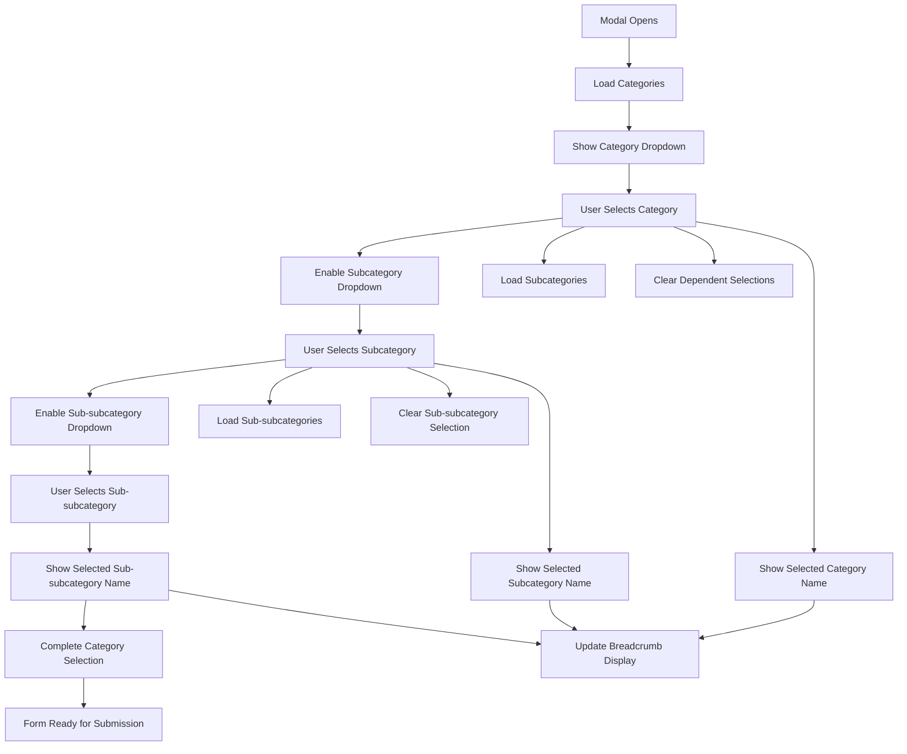

# Enhanced Dynamic Categories Implementation

## 🎯 Overview

This implementation provides a comprehensive dynamic category selection system with visual feedback, proper cascading behavior, and an enhanced product form payload structure.

## ✨ New Features Implemented

### 1. **Visual Category Selection Feedback**

#### Selected Category Display
- ✅ **Real-time Name Display**: Shows selected category name in the select trigger
- ✅ **Confirmation Indicators**: Green checkmarks with category names below each select
- ✅ **Smart Placeholders**: Context-aware placeholder text based on selection state

```tsx
// Example: Category name shown in placeholder when selected
<SelectValue placeholder={
  field.value 
    ? categories.find(c => c.id === field.value)?.name || "Select category"
    : "Select category"
} />

// Confirmation display below select
{field.value && (
  <div className="mt-1 text-sm text-green-600 flex items-center gap-1">
    <Check className="h-3 w-3" />
    <span>Selected: {categories.find(c => c.id === field.value)?.name}</span>
  </div>
)}
```

### 2. **Progressive Selection Flow**

#### Category Selection Progress Indicator
```tsx
<div className="flex items-center justify-between p-3 bg-gray-50 rounded-lg">
  <div className="flex items-center gap-4">
    <div className="flex items-center gap-2">
      <div className={`w-3 h-3 rounded-full ${watchedCategoryId ? 'bg-green-500' : 'bg-gray-300'}`} />
      <span className="text-sm font-medium">Main Category</span>
    </div>
    {/* Subcategory and Sub-subcategory indicators */}
  </div>
  <div className="text-xs text-gray-500">
    Step {currentStep} of 3
  </div>
</div>
```

#### Status Indicators:
- 🔴 **Gray dot**: Not yet available/selected
- 🔵 **Blue dot**: Available for selection (parent selected)
- 🟢 **Green dot**: Selected and confirmed

### 3. **Enhanced Category Hierarchy Display**

#### Breadcrumb-Style Visual Path
```tsx
<div className="p-4 bg-gradient-to-r from-blue-50 to-indigo-50 rounded-lg border border-blue-200">
  {/* Breadcrumb Style Category Path */}
  <div className="flex items-center gap-2 flex-wrap">
    <div className="flex items-center gap-1 px-3 py-1.5 bg-blue-100 rounded-md">
      <span className="text-xs font-medium text-blue-800">Electronics</span>
    </div>
    <span className="text-blue-400">→</span>
    <div className="flex items-center gap-1 px-3 py-1.5 bg-indigo-100 rounded-md">
      <span className="text-xs font-medium text-indigo-800">Smartphones</span>
    </div>
    <span className="text-blue-400">→</span>
    <div className="flex items-center gap-1 px-3 py-1.5 bg-purple-100 rounded-md">
      <span className="text-xs font-medium text-purple-800">Android</span>
    </div>
  </div>
</div>
```

### 4. **Smart Cascading Behavior**

#### Automatic Field Management
- ✅ **Dependent Field Clearing**: Automatically clears subcategory when category changes
- ✅ **Smart Enabling/Disabling**: Subcategory enabled only when category selected and has subcategories
- ✅ **Loading State Management**: Shows loading spinners during API calls
- ✅ **Toast Notifications**: Confirmation messages when selections are made

```tsx
const handleCategoryChange = (categoryId: string) => {
  // Clear dependent fields
  form.setValue("subCategoryId", "")
  form.setValue("subCategoryName", "")
  form.setValue("subSubCategoryId", "")
  form.setValue("subSubCategoryName", "")
  
  // Clear dependent arrays to trigger re-loading
  setSubCategories([])
  setSubSubCategories([])
  
  // Show confirmation toast
  toast({
    title: "Category Selected",
    description: `Selected: ${category?.name}`,
    variant: "default",
    duration: 2000,
  })
}
```

### 5. **Enhanced Product Form Payload**

#### Comprehensive Data Structure
```typescript
const enhancedProductPayload = {
  // Basic Product Information
  productInfo: {
    productName: data.productName.trim(),
    description: data.description.trim(),
    productDescription: data.productDescription.trim(),
    productType: data.productType?.trim() || "physical",
    keyFeatures: data.keyFeatures.split(",").map(f => f.trim()).filter(f => f.length > 0),
    specification: data.specification.trim(),
    boxContents: data.box.trim(),
    searchKeywords: data.searchKeyWord.split(",").map(k => k.trim()).filter(k => k.length > 0),
  },

  // Pricing and Inventory
  pricingInfo: {
    price: Number(data.price),
    discount: Number(data.discount || 0),
    finalPrice: Number(data.price) * (1 - (Number(data.discount || 0) / 100)),
    stockQuantity: Number(data.stockQuantity),
    inStock: data.inStock && data.stockQuantity > 0,
    lowStockThreshold: Math.max(5, Math.floor(data.stockQuantity * 0.1)),
  },

  // Enhanced Category Information with full hierarchy
  categoryInfo: {
    primary: {
      id: data.categoryId,
      name: selectedCategory?.name || "",
      slug: selectedCategory?.slug || "",
    },
    secondary: selectedSubCategory ? {
      id: data.subCategoryId!,
      name: selectedSubCategory.name,
      slug: selectedSubCategory.slug,
      parentId: data.categoryId,
    } : null,
    tertiary: selectedSubSubCategory ? {
      id: data.subSubCategoryId!,
      name: selectedSubSubCategory.name,
      slug: selectedSubSubCategory.slug,
      parentId: data.subCategoryId!,
    } : null,
    categoryPath: "Electronics > Smartphones > Android",
    categoryIds: [categoryId, subCategoryId, subSubCategoryId].filter(Boolean),
  },

  // System Information
  systemInfo: {
    createdOn: new Date().toISOString(),
    createdBy: "current-user",
    status: "pending",
    isActive: true,
    isFeatured: false,
    imageType: "product",
    version: "1.0",
  },

  // Additional metadata
  metadata: {
    totalImages: images.length,
    primaryImageId: images[0]?.id || null,
    categoryLevel: 3, // 1, 2, or 3 based on selection depth
    hasDiscount: (data.discount || 0) > 0,
    isPhysicalProduct: data.productType !== "digital",
    tags: searchKeywords,
  }
}
```

## 🎨 User Experience Flow

### Step-by-Step Category Selection

1. **Initial State**
   - Only main category dropdown is enabled
   - Progress shows "Step 0 of 3"
   - All indicators are gray

2. **Category Selected**
   - ✅ Green checkmark appears below category select
   - 🔵 Subcategory becomes available (if subcategories exist)
   - 📢 Toast notification: "Category Selected: Electronics"
   - 🗂️ Breadcrumb shows: "Electronics"
   - Progress shows "Step 1 of 3"

3. **Subcategory Selected**
   - ✅ Green checkmark appears below subcategory select
   - 🔵 Sub-subcategory becomes available (if sub-subcategories exist)
   - 📢 Toast notification: "Subcategory Selected: Smartphones"
   - 🗂️ Breadcrumb shows: "Electronics → Smartphones"
   - Progress shows "Step 2 of 3"

4. **Sub-subcategory Selected**
   - ✅ Green checkmark appears below sub-subcategory select
   - 📢 Toast notification: "Sub-subcategory Selected: Android"
   - 🗂️ Breadcrumb shows: "Electronics → Smartphones → Android"
   - Progress shows "Step 3 of 3"

### Visual States

#### Loading States
```tsx
{loadingCategories && <Loader2 className="h-3 w-3 animate-spin" />}
```

#### Selection Confirmation
```tsx
{field.value && (
  <div className="mt-1 text-sm text-green-600 flex items-center gap-1">
    <Check className="h-3 w-3" />
    <span>Selected: {categoryName}</span>
  </div>
)}
```

#### Smart Placeholders
```tsx
placeholder={
  !parentSelected 
    ? "Select parent first"
    : loading 
      ? "Loading options..." 
      : options.length === 0
        ? "No options available"
        : field.value
          ? selectedOptionName
          : "Select option"
}
```

## 🔄 Data Flow



## 📊 Enhanced Validation & Feedback

### Form Validation
- ✅ **Required Field Validation**: Category selection is mandatory
- ✅ **Image Validation**: At least one image required
- ✅ **Price Validation**: Must be greater than 0
- ✅ **Stock Validation**: Cannot be negative
- ✅ **Enhanced Error Messages**: Detailed validation feedback

### Success Feedback
```typescript
toast({
  title: "🎉 Product Created Successfully!",
  description: `${productName} has been added to ${categoryPath}`,
  variant: "default",
  duration: 5000,
})
```

## 🚀 Technical Implementation

### Key Components
- **Progress Indicator**: Visual step-by-step progress
- **Smart Selects**: Context-aware dropdowns with dynamic placeholders
- **Confirmation Display**: Green checkmarks with selected names
- **Breadcrumb Hierarchy**: Visual category path representation
- **Enhanced Payload**: Comprehensive product data structure

### Performance Optimizations
- **Lazy Loading**: Categories load only when needed
- **State Management**: Proper clearing of dependent data
- **Memory Management**: Cleanup of object URLs and unused data

## ✅ Complete Feature List

- [x] **Dynamic category loading with API integration**
- [x] **Visual selection feedback with checkmarks**
- [x] **Selected category name display in dropdowns**
- [x] **Smart enabling/disabling of dependent dropdowns**
- [x] **Loading indicators for each selection level**
- [x] **Progress indicator showing selection steps**
- [x] **Breadcrumb-style category hierarchy display**
- [x] **Toast notifications for selection confirmations**
- [x] **Enhanced product payload with comprehensive data**
- [x] **Proper form validation with detailed error messages**
- [x] **Automatic dependent field clearing**
- [x] **Context-aware placeholder text**

The implementation now provides a complete, user-friendly category selection experience with proper visual feedback, smart behavior, and comprehensive data handling.